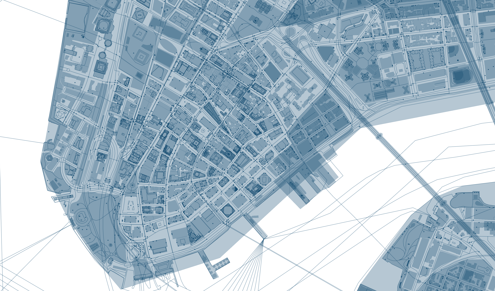

# OSM-QA-Extracts
Process for extracting OSM data from OSM QA extracts provided by OSM Lab

This service is maintained by OSM Lab. It may be preferred over other sources of OSM data because it includes:
- (almost) unsimplified geometries
- all OpenStreetMap tags
- additional properties like changeset, time, and user ids
- zoom 12
- no buffer around individual tiles

**Reference**: [OSM QA Tiles](https://osmlab.github.io/osm-qa-tiles/)



## Steps

### 1.  Download Tiles
Download the country specific tiles from [OSM QA Tiles](https://osmlab.github.io/osm-qa-tiles/country.html)

### 2. Unzip Gzip
Use your preferred zip utility to unzip `.mbtiles.gz` to `.mbtiles`

### 3. Create MBTiles Extract from the source
The country tileset may be too large to be converted to GeoJSON. It is advised to create a custom extract from the country dataset, so the data is more managable.

```sh
npm install -g tilelive mbtiles
# Create an extract of NYC from the United States of America Tileset.
tilelive-copy --minzoom=0 --maxzoom=14  --bounds="-74.268265,40.504924,-73.646164,40.964863" united_states_of_america.mbtiles NewYork.mbtiles
```

Detailed Instructions: [Create Custom Extract](https://openmaptiles.org/docs/generate/create-custom-extract/)

### 4. Decode MBTiles to GeoJSON
Use [Tippecanoe-Decode](https://github.com/mapbox/tippecanoe#tippecanoe-decode) to convert MBTiles to GeoJSON format

```sh
tippecanoe-decode -z14 -Z14 NewYork.mbtiles >> data.geojson
```

### 5. Extract features from GeoJSON
Use JQ utility to extract features from the decoded GeoJSON file

```sh
jq  --compact-output "[.features[] | .features[] |.features[]] " data.geojson > features.geojson
```

### 6. Import the features to MongoDB 
Import the features to a MongoDB collection

```sh
mongoimport --db databaseName -c features --file "features.geojson" --jsonArray
```

### 7. Aggregate buildings
Aggregate buildings from `features` collection into `buildings` collection

```sh
# Count the number of features that have height property
db.features.count({'properties.height': {$exists : true}})
# Export to buildings collection
db.features.aggregate([{ $match: {'properties.height' : {$exists : true}} },{ $out: "buildings" }])
```

### 8. Export buildings
Export the buildings collection to a JSON file

```sh
mongoexport --db databaseName -c buildings --out "building_export.json" --jsonArray 
```

### 9. Convert the exported JSON Array to GeoJSON
Wrap the JSON content within a `"FeatureCollection"` array of `"features"`.

```sh
echo '{ "type": "FeatureCollection","features":'  >> building.geojson
cat  building_export.json >> building.geojson
echo '}' >> building.geojson
```

### 10. GeoJSON to MBTiles
Use Tippecanoe utility to convert the GeoJSON file to MBTiles

```sh
tippecanoe -pd -z 14 -n <layer-name> -f -o <output-filename>.mbtiles <input-filename>.geojson # Drop all points, Max Zoom 14

tippecanoe -pd -z 14 -n building -f -o san_juan.mbtiles building.geojson # Drop all points, Max Zoom 14
```

### 11. Geojson to SHP
Use OGR2OGR utility to convert the GeoJSON file to SHP File

`ogr2ogr -f "ESRI Shapefile" data.shp "data.geojson" -skipfailures`
