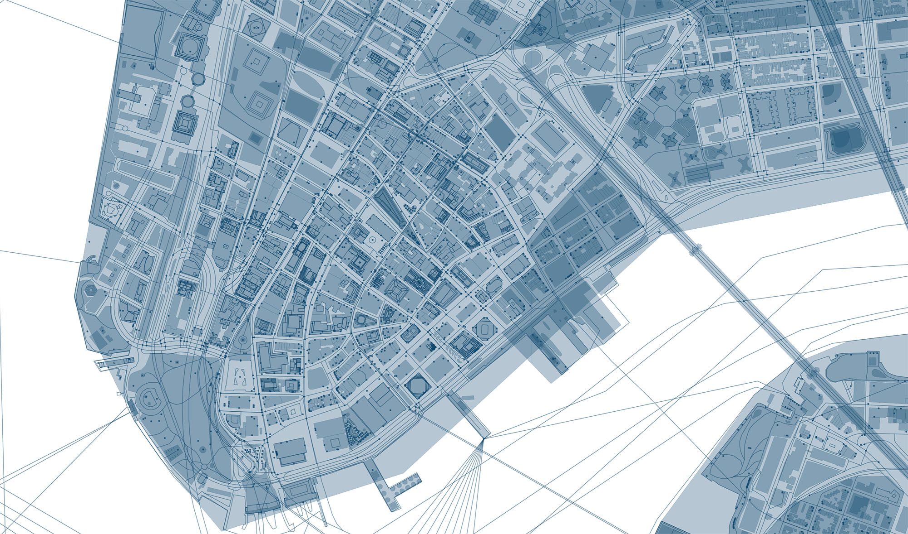
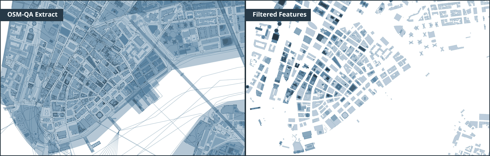

# OSM-QA-Extracts
Process for extracting OSM data from OSM QA extracts provided by OSM Lab

This service is maintained by OSM Lab. It may be preferred over other sources of OSM data because it includes:
- (almost) unsimplified geometries
- all OpenStreetMap tags
- additional properties like changeset, time, and user ids
- zoom 12
- no buffer around individual tiles

**Reference**: [OSM QA Tiles](https://osmlab.github.io/osm-qa-tiles/)



## Steps
- Download MBTiles from OSM Lab service
- Obtain the relevant MBTiles extract from the downloaded file
- Decode MBTiles to GeoJSON format
- Store GeoJSON data in a MongoDB database for futher processing
- Export the required dataset from MongoDB
- Convert the exported data to GeoJSON and SHP File
 
### 1.  Download Tiles
Download the country specific tiles from [OSM QA Tiles](https://osmlab.github.io/osm-qa-tiles/country.html)

### 2. Unzip Gzip
Use your preferred zip utility to unzip `.mbtiles.gz` to `.mbtiles`

### 3. Create MBTiles Extract from the source
The country tileset may be too large to be converted to GeoJSON. It is advised to create a custom extract from the country dataset, so the data is more managable.

```sh
npm install -g tilelive mbtiles
# Create an extract of NYC from the United States of America Tileset.
tilelive-copy --minzoom=0 --maxzoom=14  --bounds="-74.25909,40.477399,-73.700272,40.917577" united_states_of_america.mbtiles NewYork.mbtiles
```

Detailed Instructions: [Create Custom Extract](https://openmaptiles.org/docs/generate/create-custom-extract/)

### 4. Decode MBTiles to GeoJSON
Use [Tippecanoe-Decode](https://github.com/mapbox/tippecanoe#tippecanoe-decode) to convert MBTiles to GeoJSON format

```sh
tippecanoe-decode -z12 -Z12 NewYork.mbtiles >> data.geojson
```

### 5. Extract features from GeoJSON
Use JQ utility to extract features from the decoded GeoJSON file

```sh
jq  --compact-output ".features[]|.features[]|.features[]" data.geojson > features.json

```

### 6. Import the features to MongoDB 
Import the features to a MongoDB collection

```sh
mongoimport --db databaseName -c features --file "features.json"
```

### 7. Aggregate buildings
Aggregate buildings from `features` collection into `buildings` collection. *Optionally*, add some arbitrary height to buildings that are missing the `properties.height` attribute.

```sh
# Count features with properties = Buildings:True OR Height:True
db.features.find({ $or : [{'properties.building' : {$exists : true} },{'properties.height' : {$exists : true} }]}).count()

# Aggregate those features to buildings collection
db.features.aggregate([{ $match: {$or : [{'properties.building' : {$exists : true} },{'properties.height' : {$exists : true} }]} },{ $out: "buildings" }])

# Count buildings that are missing height attribute
db.buildings.count({'properties.height': {$exists : false}})

# Set default height for those buildings to '3'
db.buildings.find({'properties.height': {$exists : false}}).forEach(function(obj) {db.buildings.update({_id : obj._id},{$set : {'properties.height' : parseFloat('3')}});});

```

⚠️ **Note**: Some third-party apps and libraries expect strict data type usage. For example, Mapbox-gl-js library expects height (for 3D-building-extrusion) as number instead of string. Use the following steps to convert the field in MongoDB to correct data type

```sh
# Count the features that have height encoded as string
db.buildings.find({'properties.height' : {$type : 2} }).count()

# Convert string data type to float 
db.buildings.find({'properties.height': {$exists : 'true'}}).forEach(function(obj) {
	db.buildings.update({_id : obj._id},
	{
		$set : {'properties.height' : parseFloat(obj.properties.height)}
	});
});

# Single line command
db.buildings.find({'properties.height': {$exists : 'true'}}).forEach(function(obj) {db.buildings.update({_id : obj._id},{$set : {'properties.height' : parseFloat(obj.properties.height)}});});
```

### 8. Convert Features
For the `buildings` collection in MongoDB database, this step takes care of:
- Converting LineString features that have height to Polygons
- Dropping Points that might have been aggerated with rest of the polygon features

Some linestrings may have height property associated with it and can be converted to polygon. This is useful for extruding features in Mapbox-GL. Only polygons can be extruded.

```sh
# Count the # of Linestrings that have height
db.buildings.count({ $and: [{$or: [{'geometry.type': 'MultiLineString'},{'geometry.type': 'LineString'}]},{ 'properties.height': {$exists:true} }] })
```

Go to `LineStringsToPolygons` and run the following script

```sh
cd LineStringsToPolygons
npm install
node lineToPoly.js --mongoUrl=Your_MongoDB_URL --collectionName=Collection_Name

# Example:
node lineToPoly.js --mongoUrl=mongodb://localhost:27017/nycdb --collectionName=buildings
```

### 8. Export buildings
Export the buildings collection to a JSON file

```sh
mongoexport --db databaseName -c buildings --out "building_export.json" --jsonArray 
```

### 9. Convert the exported JSON Array to GeoJSON
Wrap the JSON content within a `"FeatureCollection"` array of `"features"`.

```sh
# Input: json-file.json 
# Output: geojson-file.geojson

echo '{ "type": "FeatureCollection","features":'  >> building.geojson ; cat  building_export.json >> building.geojson ; echo '}' >> building.geojson
```

### 10. GeoJSON to MBTiles
Use Tippecanoe utility to convert the GeoJSON file to MBTiles

```sh
tippecanoe -pd -z 14 -n <layer-name> -f -o <output-filename>.mbtiles <input-filename>.geojson # Drop all points, Max Zoom 14

# Example
tippecanoe -pd -z 14 -n building -f -o nyc.mbtiles building.geojson # Drop all points, Max Zoom 14
```


### 11. Geojson to SHP
Use OGR2OGR utility to convert the GeoJSON file to SHP File

`ogr2ogr -f "ESRI Shapefile" data.shp "data.geojson" -skipfailures`

---

#### ⚠️ UTF-8 Encoding Warning

 Make sure that the console output and resultant file output is utf-8. Otherwise JQ may not work as expected.

**Windows Powershell Users**: Set output encoding to utf-8 [Reference](https://stackoverflow.com/questions/40098771/changing-powershells-default-output-encoding-to-utf-8)

```sh
# You can set out-file encoding to utf8 
$PSDefaultParameterValues['Out-File:Encoding'] = 'utf8'

# OR to convert a text file to utf8
Get-Content UTF-16LE_encoded.geojson | Set-Content -Encoding utf8 utf8_encoded.geojson
```